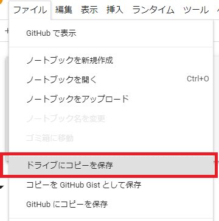
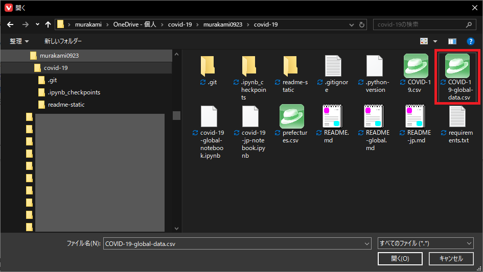
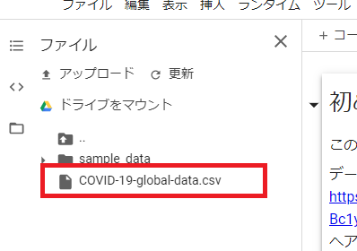

# covid-19

<!-- TOC depthTo:3 -->

- [covid-19](#covid-19)
- [概要](#概要)
- [データファイルの取得元について](#データファイルの取得元について)
- [動作環境](#動作環境)
- [注意、お願い](#注意お願い)
- [利用方法](#利用方法)
    - [ローカル環境で使う場合](#ローカル環境で使う場合)
        - [前提](#前提)
        - [環境構築](#環境構築)
        - [データファイルをダウンロード](#データファイルをダウンロード)
        - [Jupyter Labを起動](#jupyter-labを起動)
    - [GoogleColaboratoryで使う場合](#googlecolaboratoryで使う場合)
        - [githubからノートブックをインポート](#githubからノートブックをインポート)
        - [データファイルをダウンロード](#データファイルをダウンロード-1)

<!-- /TOC -->

# 概要

COVID-19の感染者数について、

- 国（できれば複数）して、それらの国の時系列変化をみてみたい
- 特定の日付（今日、昨日、先週の○曜日、など）を指定して、その日の国別の感染者数を見てみたい

という思いがあり、感染者データのCSVファイルから集計してグラフを生成する処理を、Jupyter Labで作成しました。

# データファイルの取得元について

[https://data.humdata.org/dataset/coronavirus-covid-19-cases-and-deaths/resource/2ac6c3c0-76fa-4486-9ad0-9aa9e253b78d](https://data.humdata.org/dataset/coronavirus-covid-19-cases-and-deaths/resource/2ac6c3c0-76fa-4486-9ad0-9aa9e253b78d)

# 動作環境

当初は、ローカルでPython3、Jupyter Labをインストールして実行するように作成しましたが、  
ローカルに環境を立てる手間がかかる、勃て方がわからない、などのケースも考えられることから、  
Google Colaboratoryにノートブックをインポートして実行できるようにしました。

# 注意、お願い

- データファイルや、都道府県CSVのファイル(Google Colaboratoryの場合)のダウンロードは、必要最低限の回数にしてください。
- 手探りで作っているので、間違いや使いにくいところなど、あるかと思いますが、ご了承ください。
- このソフトウェアを使用することにより損害が生じた場合には、第三者への損害や被害の修復も含み、その結果責任は全て利用者に帰することとします。

# 利用方法
## ローカル環境で使う場合
### 前提

- OS
  - Mac
  - Linux
  - WSL
- Python 3.8.2
    - 開発の際はpyenvを使っています。
      - pyenv、pyenv-virtualenvインストールの参考 : [https://qiita.com/Kodaira_/items/feadfef9add468e3a85b](https://qiita.com/Kodaira_/items/feadfef9add468e3a85b)

### 環境構築

```sh
pip install -U pip
pip install -r requirements.txt
```

### データファイルをダウンロード

データファイルを直接curl等でダウンロードできないため、まず、ブラウザで  
[https://docs.google.com/spreadsheets/d/e/2PACX-1vSe-8lf6l_ShJHvd126J-jGti992SUbNLu-kmJfx1IRkvma_r4DHi0bwEW89opArs8ZkSY5G2-Bc1yT/pub?gid=0&single=true&output=csv](https://docs.google.com/spreadsheets/d/e/2PACX-1vSe-8lf6l_ShJHvd126J-jGti992SUbNLu-kmJfx1IRkvma_r4DHi0bwEW89opArs8ZkSY5G2-Bc1yT/pub?gid=0&single=true&output=csv)  
へアクセスしてください。

すると、CSVファイルがダウンロードできるため、ファイル名を `COVID-19-global-data.csv` として、このREADMEを置いているフォルダに保存してください。


### Jupyter Labを起動

```sh
jupyter lab
```

Jupyter Labが起動したら、`covid-19-jp-notebook.ipynb` を開き、実行します。
詳細については `covid-19-jp-notebook.ipynb` に記載していきます。

## GoogleColaboratoryで使う場合
### githubからノートブックをインポート
#### ノートブックを開くダイアログを表示

Google Colaboratoryのサイト（[https://colab.research.google.com/](https://colab.research.google.com/)）を開きます。

最初に開いたタイミングで、ノートブックを開くダイアログが表示されます。  
ダイアログが表示されない場合は、「ファイル」→「ノートブックを開く」でダイアログが表示されます。


#### githubからのインポート

ノートブックを開くダイアログが開いたら、「GitHub」タブを開き、以下のように入力・選択します。

- githubのURL：[https://github.com/murakami0923/covid-19](https://github.com/murakami0923/covid-19)
- リポジトリ：murakami0923/covid-19
- ブランチ：master

これを入力すると、以下のように、ノートブックのファイルの一覧が表示されます。


`covide-19-global-notebook.ipynb` のファイル名をクリックすると、ブラウザの新しいタブにノートブックが表示されます。

#### ドライブにコピーを保存

githubからインポートしたノートブックの画面になるので、ドライブにコピーを保存します。  
「ファイル」→「ドライブにコピーを保存」



### データファイルをダウンロード

Google Colaboratoryのページの左端にあるフォルダーのアイコンをクリックします。


ファイルブラウザが表示されるので、「アップロード」をクリックします。


ファイル選択ボックスが表示されるので、ローカルにダウンロードした `COVID-19-global-data.csv` のファイルを選択して開きます。



アップロード時に以下のような注意書きが表示される場合があるので「OK」をクリックします。


アップロードすると、ファイルブラウザの表示が更新されます。



このように`COVID-19-global-data.csv` のファイルが表示されていれば、アップロードが成功したので、ノートブックを実行します。
