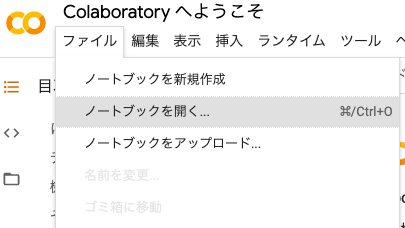
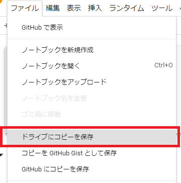

# covid-19

<!-- TOC depthTo:3 -->

- [covid-19](#covid-19)
- [概要](#概要)
- [動作環境](#動作環境)
- [注意、お願い](#注意お願い)
- [事前準備](#事前準備)
    - [ローカル環境で使う場合](#ローカル環境で使う場合)
        - [前提](#前提)
        - [環境構築](#環境構築)
        - [データファイルをダウンロード](#データファイルをダウンロード)
        - [Jupyter Labを起動](#jupyter-labを起動)
    - [GoogleColaboratoryで使う場合](#googlecolaboratoryで使う場合)
        - [githubから](#githubから)
        - [ダウンロードを有効に（初回実行、データファイルの最新版を取得し直す場合）](#ダウンロードを有効に初回実行データファイルの最新版を取得し直す場合)
        - [ダウンロードを無効に（ダウンロードしたファイルで実行）](#ダウンロードを無効にダウンロードしたファイルで実行)

<!-- /TOC -->

# 概要

- COVID-19の感染者データ
  - ~~https://github.com/kaz-ogiwara/covid19.git~~
  - [https://jag-japan.com/covid19map-readme/](https://jag-japan.com/covid19map-readme/)
    - CSV : [https://dl.dropboxusercontent.com/s/6mztoeb6xf78g5w/COVID-19.csv](https://dl.dropboxusercontent.com/s/6mztoeb6xf78g5w/COVID-19.csv)

# 動作環境

- ローカルでPython3、Jupyter Labをインストールして実行
- Google Colaboratoryにノートブックをインポートして実行

# 注意、お願い

- データファイルや、都道府県CSVのファイル(Google Colaboratoryの場合)のダウンロードは、必要最低限の回数にしてください。

# 事前準備
## ローカル環境で使う場合
### 前提

- OS
  - Mac
  - Linux
  - WSL
- Python 3.8.2
    - 開発の際はpyenvを使っています。
      - pyenv、pyenv-virtualenvインストールの参考 : [https://qiita.com/Kodaira_/items/feadfef9add468e3a85b](https://qiita.com/Kodaira_/items/feadfef9add468e3a85b)

### 環境構築

```sh
pip install -U pip
pip install -r requirements.txt
```

### データファイルをダウンロード

初回実行時、および、最新のデータファイルを取得する際には、以下のようにしてデータファイルをダウンロードします。

```sh
curl -o COVID-19.csv https://dl.dropboxusercontent.com/s/6mztoeb6xf78g5w/COVID-19.csv
```

### Jupyter Labを起動

```sh
jupyter lab
```

Jupyter Labが起動したら、`covid-19-notebook.ipynb` を開き、実行します。
詳細については `covid-19-notebook.ipynb` に記載していきます。

## GoogleColaboratoryで使う場合
### githubから
#### ノートブックを開くダイアログを表示

Google Colaboratoryのサイト（[https://colab.research.google.com/](https://colab.research.google.com/)）を開きます。

最初に開いたタイミングで、ノートブックを開くダイアログが表示されます。  
ダイアログが表示されない場合は、「ファイル」→「ノートブックを開く」でダイアログが表示されます。



#### githubからのインポート

ノートブックを開くダイアログが開いたら、「GitHub」タブを開き、以下のように入力・選択します。


- githubのURL：[https://github.com/murakami0923/covid-19](https://github.com/murakami0923/covid-19)
- リポジトリ：murakami0923/covid-19
- ブランチ：master

#### ドライブにコピーを保存

githubからインポートしたノートブックの画面になるので、ドライブにコピーを保存します。  
「ファイル」→「ドライブにコピーを保存」



### ダウンロードを有効に（初回実行、データファイルの最新版を取得し直す場合）

Google Colaboratory上では、初回実行時に、都道府県CSVとデータファイルをダウンロードする必要があります。  
ダウンロードを有効にするフラグを `DOWNLOAD` の定数として設定していますので、初回だけ値を変更します。


### ダウンロードを無効に（ダウンロードしたファイルで実行）

一旦、都道府県CSVとデータファイルをダウンロードしたら、 `DOWNLOAD` の定数をもとに戻します。


